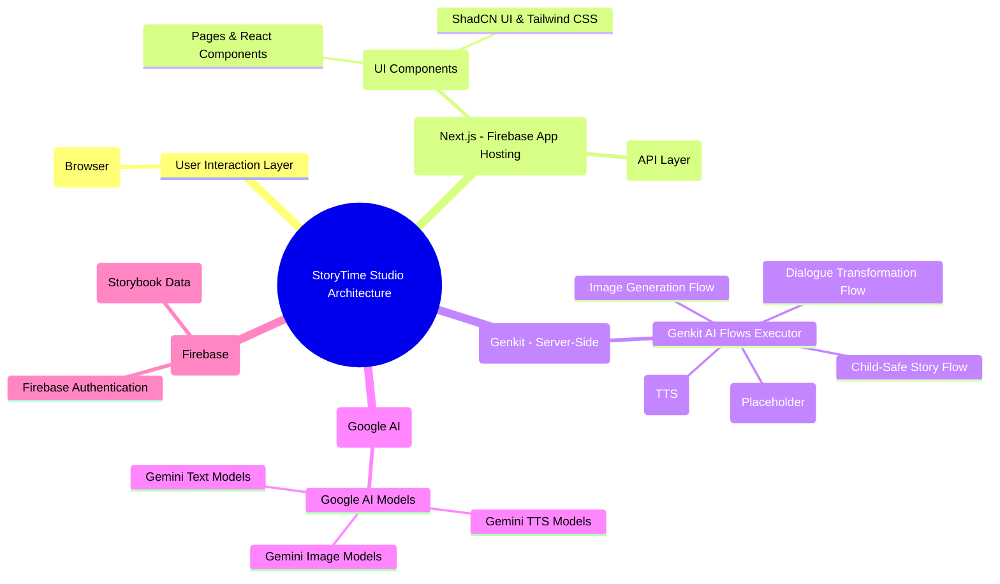

```mermaid
mindmap
  root((StoryTime Studio Architecture))
    User Interaction Layer
      User (Browser)
    Presentation Layer (Next.js - Firebase App Hosting)
      Next.js App (UI Components)
        Pages & React Components
        ShadCN UI & Tailwind CSS
      Next.js Server Actions (API Layer)
    AI Processing Layer (Genkit - Server-Side)
      Genkit AI Flows Executor
        Child-Safe Story Flow
        Dialogue Transformation Flow
        Image Generation Flow
        Voice Generation Flow (TTS)
        Animation Generation Flow (Placeholder)
    External AI Services (Google AI)
      Google AI Models
        Gemini Text Models
        Gemini Image Models
        Gemini TTS Models
    Data & Authentication Layer (Firebase)
      Firebase Authentication
      Firebase Firestore (Storybook Data)
```
